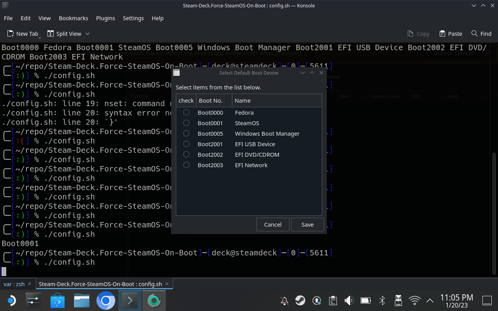

# Steam-Deck.Force-SteamOS-On-Boot
When Dual Booting, This Script will Force SteamOS to Boot back into SteamOS when Powering on rather than Windows

The Script can also be manually configured to Boot into other OSes from the install script as such:

# How Does this work?

A systemd service is installed that tells the system to launch SteamOS on the next boot (as seen in `efibootmgr`).

Updated Script will now set `BootNext` (the next OS to boot) to `CurrentBoot` (the OS you are currently in aka SteamOS)

# Install (via Curl)

In Konsole type `curl -sSL https://raw.githubusercontent.com/scawp/Steam-Deck.Force-SteamOS-On-Boot/main/curl_install.sh | bash`

# Uninstall

Simply Delete the service

`sudo rm /etc/systemd/system/force-steamos-on-next-boot.service`

# Found a Bug?

Please add to the `issues` tab! https://github.com/scawp/Steam-Deck.Force-SteamOS-On-Boot/issues

# "This is cool! How can I thank you?"
### Why not drop me a sub over on my youtube channel ;) [Chinballs Gaming](https://www.youtube.com/chinballsTV?sub_confirmation=1)

### Also [Check out all these other things I'm making](https://github.com/scawp/Steam-Deck.Tools-List)
